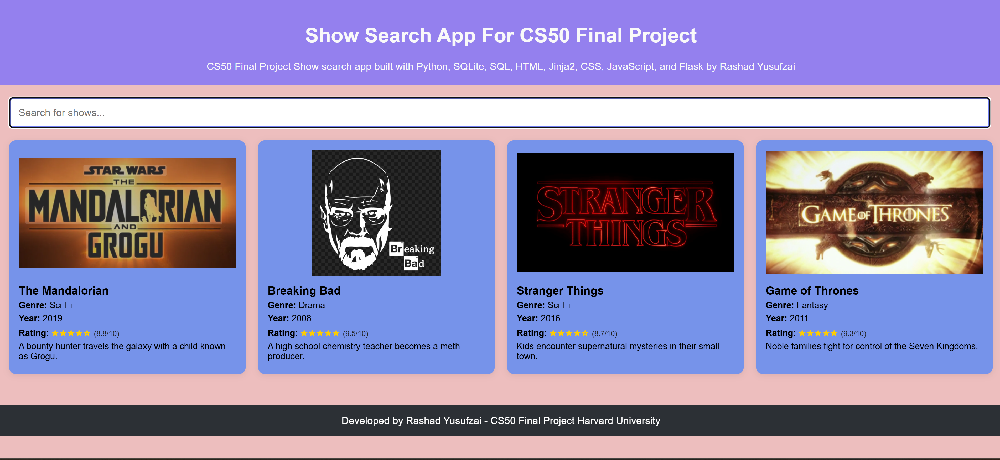
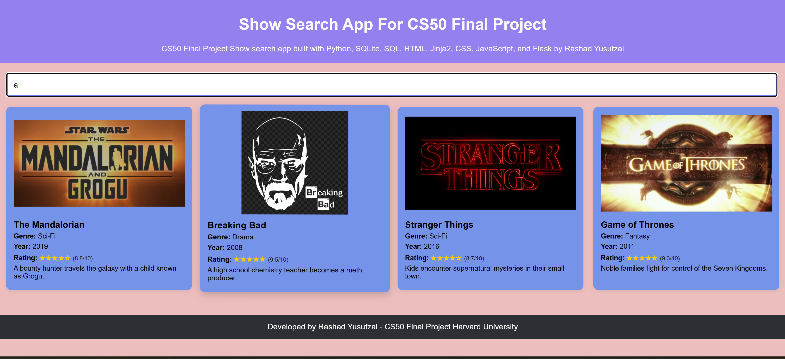
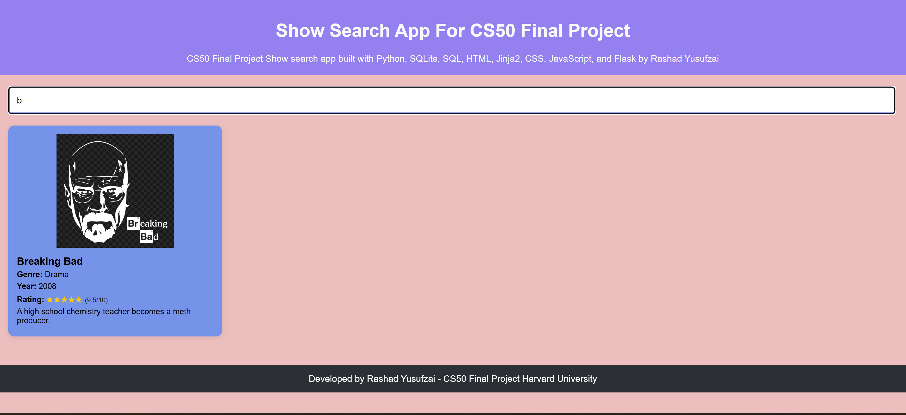
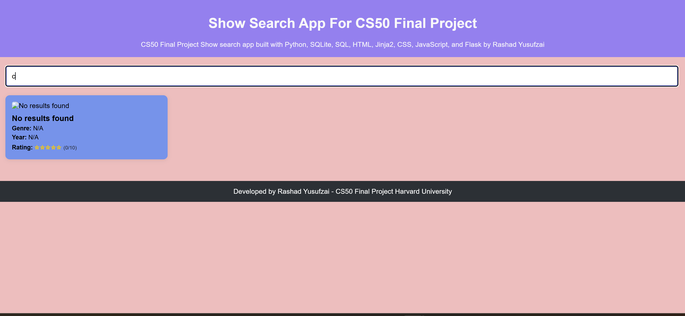
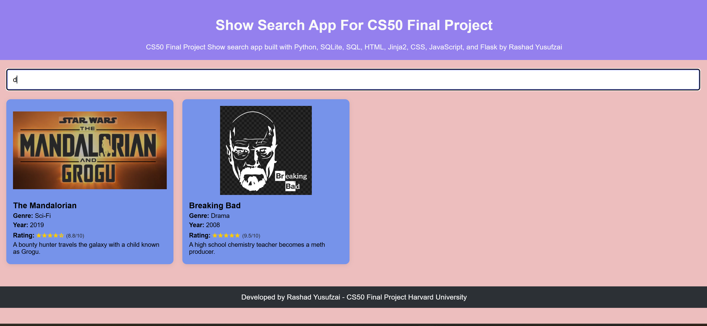
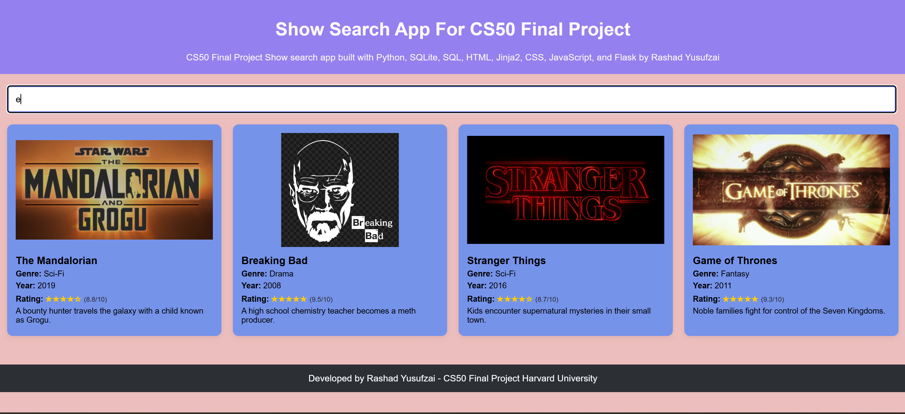
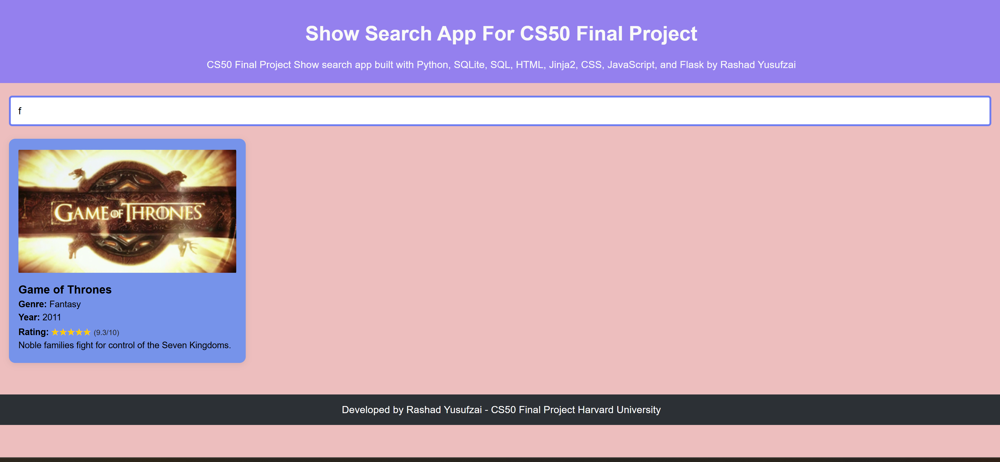
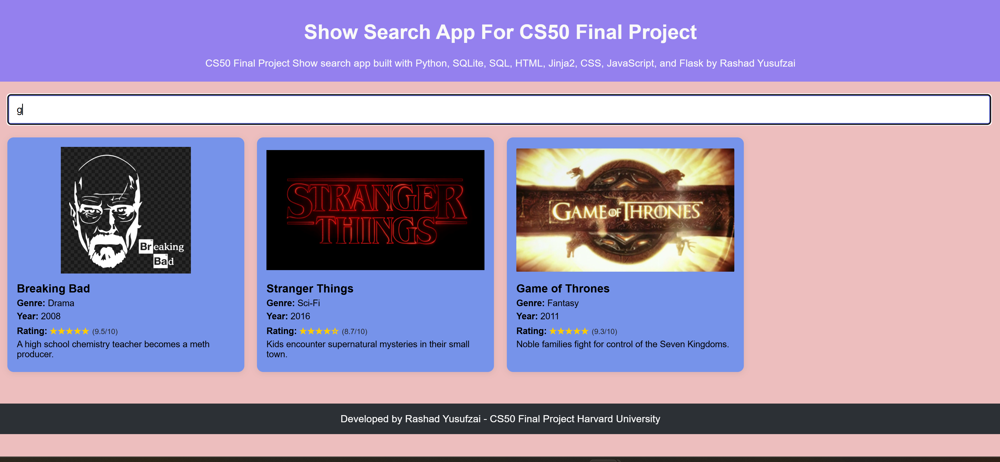

# 🎓 Show Search App — CS50 Final Project

**Author:** Rashad Yusufzai
**GitHub:** RashYus1
**edX / CS50 username:** RY-IT
**City, Country:** Gothenburg, Sweden
**Date:** 2025-08-17

---

## 📹 Video Demo

**URL:** <https://youtu.be/Cxk2oo1hlH4>

---

## 📝 Description

Show Search App is a Flask web application that allows users to search for TV shows stored in a local SQLite database. The app returns JSON for both the “popular” list and live search queries, and renders interactive cards on the page without reloading (AJAX via Fetch API).

The application is designed with a clean separation of concerns:

- **Backend (Flask + SQLite):** Provides fast JSON endpoints: `/popular` for the default set of shows, and `/search?q=...` for live search queries.
- **Frontend (HTML/CSS/JavaScript):** Renders a responsive grid of “cards” showing each show’s title, genre, year, star rating, and description. Includes a smooth fade-in animation and subtle 3D hover effect for better user experience.
- **Database (SQLite):** Stores TV show information in a `shows.db` database. Ratings are stored as numbers (0–10) and converted to a 0–5 star format in the UI.

This app is lightweight, easy to run locally, and easy to extend. You can add more shows to the database, modify styling, or expand the schema to include genres, cast members, or images.

---

## ✨Features

- **Live Search:** Type any part of a show’s title and see instant results without reloading the page.
- **Popular Shows List:** Automatically displayed on the homepage when no search is active.
- **Dynamic Cards:** Each result displays an image, title, genre, year, star rating, and short description.
- **Fallbacks:** Displays placeholder images and text when data is missing.
- **Responsive Design:** Works well on desktop, tablet, and mobile devices.
- **Local or Remote Images:** Supports images from `/static/images/` or external URLs.

> **Note on search behavior:** Results depend entirely on your database content. Typing **"a"** may match many titles, while **"b"** might only match one, and **"c"** might match none.

---

## 💡 Background and Inspiration

This project was inspired by the need for a **simple and fast media search tool** that can work entirely offline or online, depending on the use case. While many streaming services offer search functionality, they often require heavy back-end infrastructure, subscriptions, or API keys.

I wanted something that:

1. Could be run locally without depending on external APIs.
2. Was small enough to understand in its entirety (both backend and frontend).
3. Could be expanded into a more complex application, such as a movie tracker or personal library manager.

The CS50 final project requirements provided the perfect framework to build such an application. This project demonstrates not only programming skills, but also good software design practices.

---

## 🛠 Technology Stack

- **Python 3** — main programming language
- **Flask** — lightweight web framework
- **SQLite** — database engine
- **CS50’s SQL library** — simplifies database access
- **HTML/CSS/JavaScript** — front-end structure, styling, and interactivity
- **Fetch API** — for making AJAX requests
- **Jinja2** — template rendering
- **JSON** — for structured API responses

---

### 📦 Requirements File

This project includes a `requirements.txt` file for easy setup.
It lists the main dependencies:

---

### 🏆 Final_Project

final_project/
│
├── README.md
├── app.py
├── requirements.txt
│   └── contains Flask + cs50
├── shows.db
├── static/
├── templates/
│   ├── index.html
│   └── search.html
├── screenshots/
│   ├── 1-final-project-CS50.png
│   ├── 2-a-final-project-CS50.png
│   ├── 3-b-final-project-CS50.png
│   ├── 4-c-final-project-CS50.png
│   ├── 5-d-final-project-CS50.png
│   ├── 6-e-final-project-CS50.png
│   ├── 7-f-final-project-CS50.png
│   └── 8-g-final-project-CS50.png
└── venv/

---

## 🗃 Database Schema

Below is the SQL schema for the `shows` table:

CREATE TABLE shows (
    id INTEGER PRIMARY KEY AUTOINCREMENT,
    title TEXT NOT NULL,
    genre TEXT,
    year INTEGER,
    rating REAL,
    description TEXT,
    image_url TEXT
)

---

### 🖼 Screenshots

### Home Page



### Search Results A



### Search Results B



### Search Results C



### Search Results D



### Search Results E



### Search Results F



### Search Results G



---

## 🚀 How to Run

### 1. Create a Virtual Environment

It is recommended to use a virtual environment (`venv`) to keep dependencies isolated.

#### On macOS / Linux (including Ubuntu on Windows via WSL)

```bash
python3 -m venv venv
source venv/bin/activate
```

#### On Windows (PowerShell or Command Prompt)

python -m venv venv
venv\Scripts\Activate

#### 2. Install Dependencies

pip install -r requirements.txt

#### 3. Run the Application

python3 app.py
(or python app.py on Windows)

#### 4. Open in Browser

Go to:
[http://127.0.0.1:5000](http://127.0.0.1:5000)

---

#### 📤 Push Project to GitHub

In VS Code terminal (Ubuntu/WSL):

git add .
git commit -m "Final project submission"
git push origin main

---

## 🔮 Future Improvements

If I had more time, I would add:
A user login system so each user could have favorites and watchlists.
A ratings and review system for community interaction.
Pagination for search results.
Drag-and-drop database management via a web interface.
A dark mode for better accessibility.

---

## 🤖 AI Disclosure

This project was developed by Rashad Yusufzai with assistance from AI tools. AI was used to improve documentation clarity, structure the README, and refine project organization. All coding decisions, testing, and database setup were done manually by the author.
